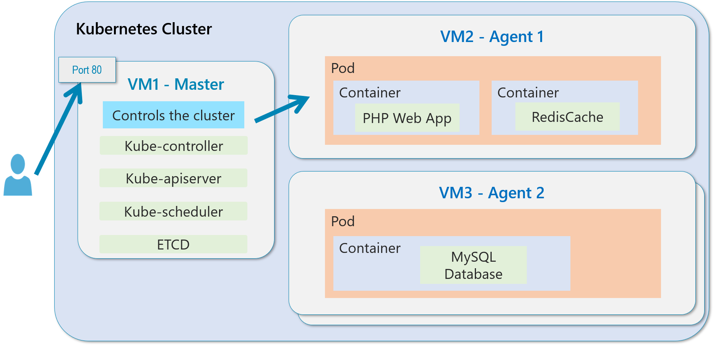
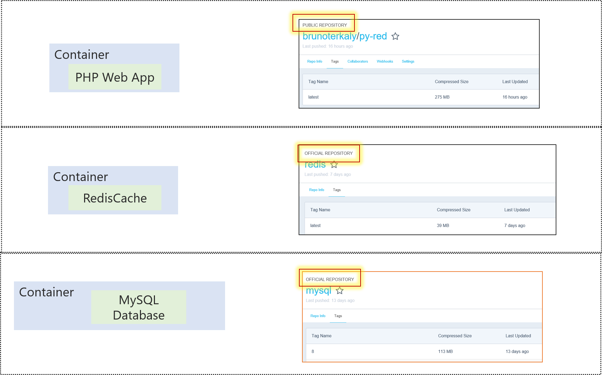
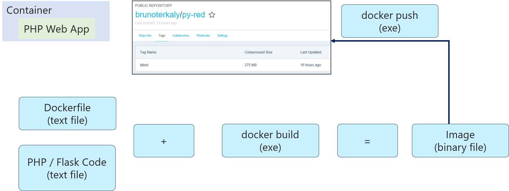
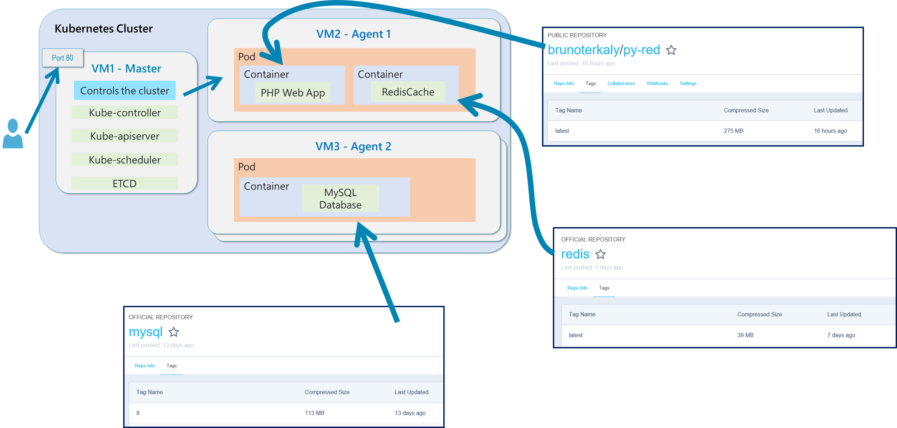

# K8s Multi Container


A multi-container web application application that runs in Kubernetes.

It has:

- A Python Based (Flask Web Front end)
- A Redis Cache to avoid too many hits againsts the database
- A MySQL database





One of the containers is custom built (py-red). It is available from hub.docker.com. The other containers are standard images from Official Repositories.



The py-red container is build with standard Docker build tools.



The deployment footprint looks like this:




## app.py

```
from flask import Flask
from flask import Response
from flask import request
from redis import Redis
from datetime import datetime
import MySQLdb
import sys
import redis
import time
import hashlib
import os
import json

app = Flask(__name__)
startTime = datetime.now()
R_SERVER = redis.Redis(host=os.environ.get('REDIS_HOST', 'redis'), port=6379)

@app.route('/healthz')
def healthz():
    return Response("Is Healthy", status=200, mimetype='application/json')

@app.route('/healthzdb')
def testdb():
    try:
        db = MySQLdb.connect("mysql","root","password")
        cursor = db.cursor()
        cursor.execute("SELECT 1")
        return Response("DB is Healthy", status=200, mimetype='application/json')
    except:
        return Response("DB not Healthy", status=404, mimetype='application/json')

@app.route('/init')
def init():
    try:
       db = MySQLdb.connect("mysql","root","password")
       cursor = db.cursor()
       cursor.execute("DROP DATABASE IF EXISTS AZUREDB")
       cursor.execute("CREATE DATABASE AZUREDB")
       cursor.execute("USE AZUREDB")
       sql = """CREATE TABLE courses(id INT, coursenumber varchar(48),
                     coursetitle varchar(256), notes varchar(256));"""
       cursor.execute(sql)
       db.commit()
       return "\nDB Initialization done\n\n"
    except (MySQLdb.Error, MySQLdb.Warning) as e:
       return "MySQL Error: %s" % str(e)

@app.route("/courses/add", methods=['POST'])
def add_courses():

    try:
       db = MySQLdb.connect("mysql","root","password")
       cursor = db.cursor()
       cursor.execute("USE AZUREDB")
       req_json = request.get_json()
       cursor.execute("INSERT INTO courses (id, coursenumber, coursetitle, notes) VALUES (%s,%s,%s,%s)",
             (req_json['uid'], req_json['coursenumber'], req_json['coursetitle'], req_json['notes']))
       db.commit()
       return Response("Added\n\n", status=200, mimetype='application/json')
    except (MySQLdb.Error, MySQLdb.Warning) as e:
       return "MySQL Error: %s" % str(e)

@app.route('/courses/<uid>')
def get_courses(uid):
    try:
       hash = hashlib.sha224(str(uid)).hexdigest()
       key = "sql_cache:" + hash

       returnval = ""
       if (R_SERVER.get(key)):
           return "\n\nFrom Redis Cache:\n" + R_SERVER.get(key)
       else:
           db = MySQLdb.connect("mysql","root","password")
           cursor = db.cursor()
           cursor.execute("USE AZUREDB")
           cursor.execute("select coursenumber, coursetitle, notes from courses where ID=" + str(uid))
           data = cursor.fetchall()
           if data:
               json_data = json.dumps(data)
               R_SERVER.set(key,json_data)
               R_SERVER.expire(key, 500)
               return R_SERVER.get(key) + "\n\nSuccess\n\n"
           else:
               return "\n\nRecord not found\n\n"
    except (MySQLdb.Error, MySQLdb.Warning) as e:
       return "MySQL Error: %s" % str(e)

if __name__ == "__main__":
    app.run(host="0.0.0.0", port=5000, debug=True)
```